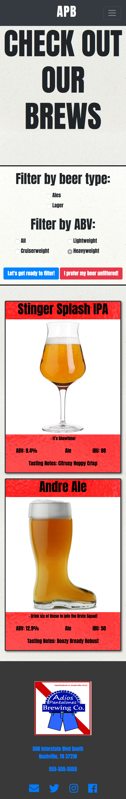

# Adios Los Pantalones Brewery Website

### Descripton:
##### A site for the wonderful APB! Has a home, brewmasters, beers, and about page. 

A simple age checker module that pops up on homepage initial load. If you click RING OUT then it takes you to a random kids webiste. If you click TAG ME IN that it lets you view the page

This is our homepage, complete with navbar, carousel of beer images, three cards with links to the other pages and footer.

The beermaster page! Shows off our brewmasters!

The beers page shows off our beers!

You can filter through our beer by ale or lager, and then also by the ABV type. You can also click UNFILTERED and it shows all

The about page! All about us and a way to comment on the bottom

This is what it looks like when you add a comment

This is when you click the edit button

It looks dope on a cellphone too!

### Technologies Used: 
* HTML5
* CSS
* JavaScript
* Bootstrap
* Flexbox

### How to run:

1. Go to: `https://www.npmjs.com/package/http-server` and install "http-server".  
2. Navigate to the project folder in command line interface and type: `http-server -p 8080`  
3. This will show at: `http://localhost:8080` in your internet browser.  